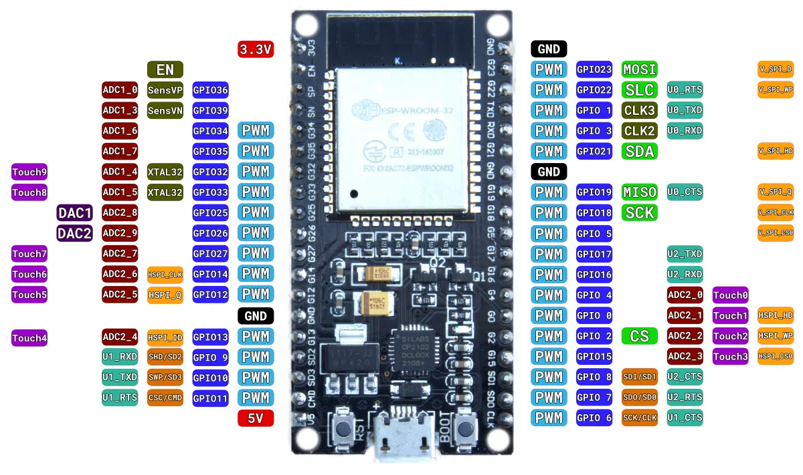
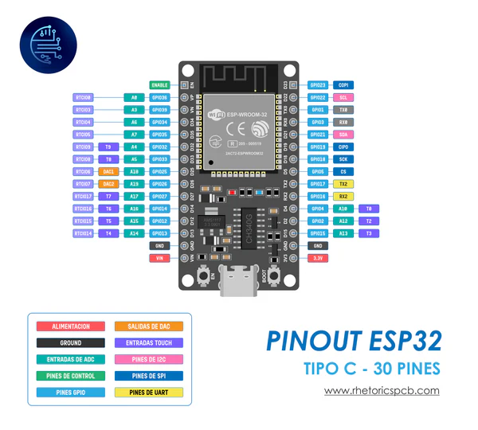
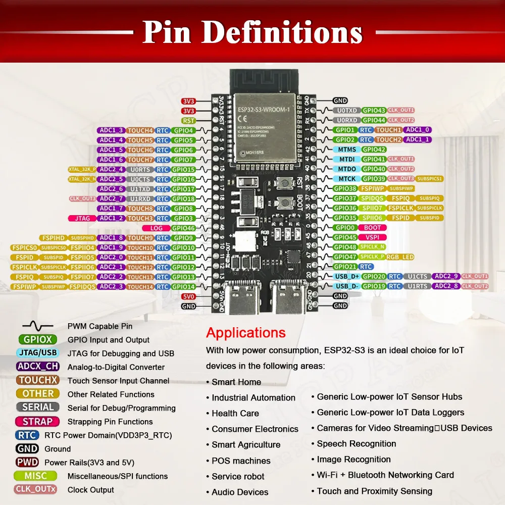

# Description
This project documents the difference between different ESP32 boards and their configuration with platformio

## NodeMCU-32 38-pin ESP32
### Pinout

### Platformio config
```mk
[env:esp32doit-devkit-v1]
platform = espressif32
board = esp32doit-devkit-v1
framework = arduino
monitor_speed = 115200
```
### Info
Does not require any extra boot/serial setup

## CP2102 30-pin ESP32
### Pinout

### Platformio config
```mk
[env:esp32doit-devkit-v1]
platform = espressif32
board = esp32doit-devkit-v1
framework = arduino
monitor_speed = 115200
```
### Info
Does not require any extra boot/serial setup

## ESP32 C3 Supermini
### Pinout

### Platformio config
```mk
[env:esp32-c3-devkitm-1]
platform = espressif32
board = esp32-c3-devkitm-1
framework = arduino
monitor_speed = 115200
build_flags = 
    -D ARDUINO_USB_MODE=1
    -D ARDUINO_USB_CDC_ON_BOOT=1 
```
### Info
Requires first boot + reset operation for accessing terminal

## ESP32 S3 double USB-C
### Pinout

### Platformio config
```mk
[env:esp32-s3-devkitc-1]
platform = espressif32
board = esp32-s3-devkitc-1
framework = arduino
monitor_speed = 115200
```
### Info
Does not require any extra boot/serial setup