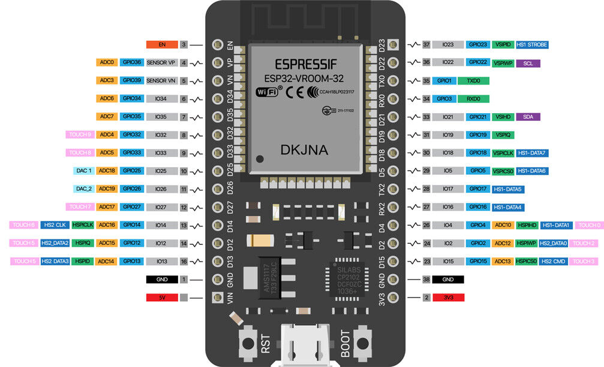
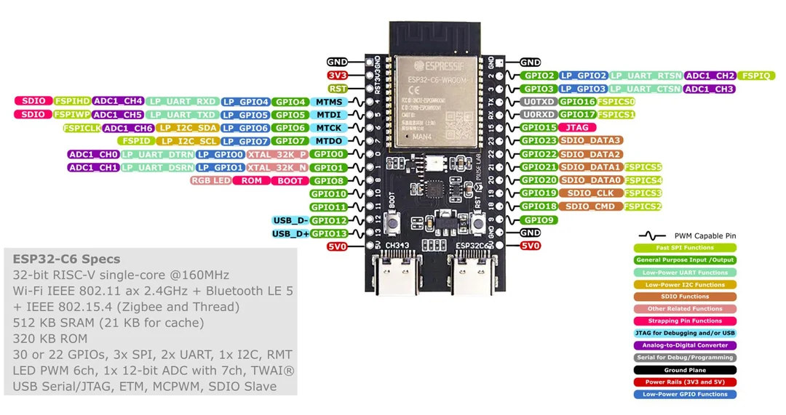

# Description
This project documents the difference between different ESP32 boards and their configuration with platformio

## NodeMCU ESP32-DevKit 30 pines
### Pinout

### Platformio config
```mk
[env:esp32doit-devkit-v1]
platform = espressif32
board = esp32doit-devkit-v1
framework = arduino
monitor_speed = 115200
```
### Info
Does not require any extra boot/serial setup

## NodeMCU-32 38-pin ESP32
### Pinout

### Platformio config
```mk
[env:esp32doit-devkit-v1]
platform = espressif32
board = esp32doit-devkit-v1
framework = arduino
monitor_speed = 115200
```
### Info
Does not require any extra boot/serial setup

## CH340C 30-pin ESP32
### Pinout

### Platformio config
```mk
[env:esp32doit-devkit-v1]
platform = espressif32
board = esp32doit-devkit-v1
framework = arduino
monitor_speed = 115200
```
### Info
Does not require any extra boot/serial setup

## ESP32 C3 Supermini
### Pinout

### Platformio config
```mk
[env:esp32-c3-devkitm-1]
platform = espressif32
board = esp32-c3-devkitm-1
framework = arduino
monitor_speed = 115200
build_flags = 
    -D ARDUINO_USB_MODE=1
    -D ARDUINO_USB_CDC_ON_BOOT=1 
```
### Info
Requires first boot + reset operation for accessing terminal

## ESP32 S3 double USB-C
### Pinout

### Platformio config
```mk
[env:esp32-s3-devkitc-1]
platform = espressif32
board = esp32-s3-devkitc-1
framework = arduino
monitor_speed = 115200
```
### Info
Does not require any extra boot/serial setup

RGB Ping is 48(requires solder pin in board)

## NanoESP32 C6 double USB-C N16 MuseLab(30 pins)
### Pinout

### Platformio config   
```mk
; [env:esp32-c6-devkitc-1]
; platform = espressif32
; board = esp32-c6-devkitc-1
; framework = espidf
; monitor_speed = 115200

board_upload.flash_size = 16MB
board_upload.maximum_size = 16777216
```
### Info
Does not require any extra boot/serial setup

RGB Ping is 8